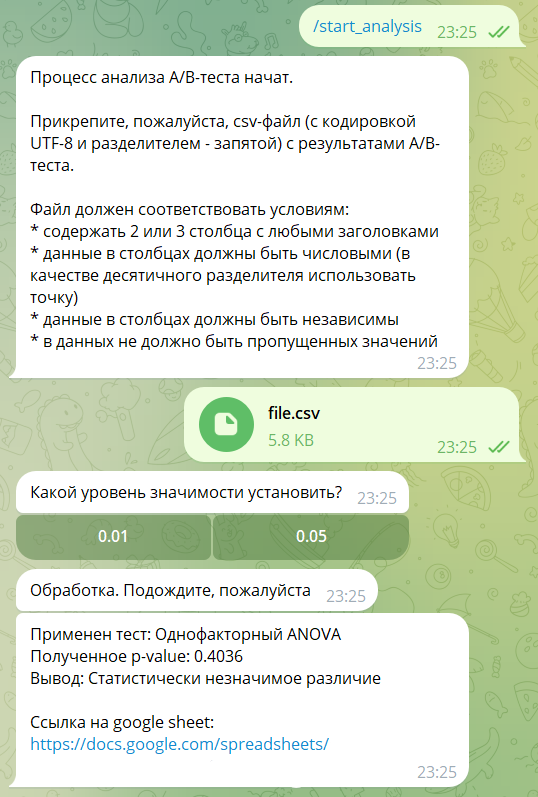
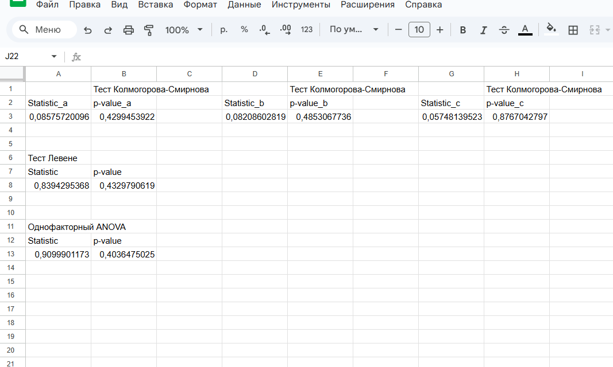

# A/B Tests Helper Bot
Этот проект представляет собой телеграм бота, который позволяет определить наличие статистически значимого различия средних/медиан между двумя или тремя выборками.

### Требования
- Python 3.8+
- Docker

## Установка
1. Клонируйте репозиторий:
```bash
git clone https://github.com/homeycoon/ab_tests_helper_bot.git
cd ab_tests_helper_bot
```
2. Создайте файлы:
- `app/.env` (заполнить переменные по примеру .env.example)
- `.env.docker` (заполнить переменные по примеру .env.docker.example)

**ВАЖНО**: чтобы Вы могли пользоваться ботом, Вам необходимо создать учетную запись сервиса (службы) в Google Cloud. Для этого Вам, вероятно, сначала нужно будет создать там проект, а после следовать [инструкции](https://developers.google.com/workspace/guides/create-credentials?hl=ru#service-account).

После создания учетной записи сервиса / службы Вам необходимо [создать учетные данные сервиса / службы](https://developers.google.com/workspace/guides/create-credentials?hl=ru#create_credentials_for_a_service_account), и сохранить их как файл credentials.json в директорию `app/tools`.

3. Запустите в терминале команду:
```bash
docker-compose up --build
```
Начнется сборка и запуск контейнеров. Дождитесь появления в терминале сообщения о завершении запуска бота. Бот готов к работе.

### Использование бота
1. После запуска необходимо отправить боту команду `/start`. Бот ознакомит с его функционалом и предложит начать процесс его тестирования.
2. Нажмите команду `/start_analysis` для запуска процесса использования бота. Бот предложит прикрепить csv-файл с данными проведенного а/б-теста. Файл должен удовлетворять следующим условиям:
	- должен быть _формата csv_ (кодировка - UTF-8; разделитель - запятая);
	- содержать _2 или 3 столбца_ с любыми заголовками;
	- данные в файле должны быть _числовыми_;
	- данные в столбцах должны быть _независимыми_;
	- в данных _не должно быть пропущенных значений_.
3. Бот проверит файл на соответствие представленным выше условиям и, в случае нахождения несоответствия, сообщит о нем. Бот не будет обрабатывать данные в случае, если они не соответствуют условиям (кроме условия независимости наблюдений, однако в этом случае результаты анализа могут быть некорректны).
4. Бот также проверит данные на наличие выбросов и, если их обнаружит, то сообщит о них и предложит три варианта дальнейших действий:
	- обработать выбросы и загрузить файл заново;
	- продолжить обработку файла несмотря на выбросы;
	- использовать метод "Бутстрап", который менее чувствителен к выбросам, так как определяет статистическую значимость между медианами, а не средними значениями.
5. Если выбросы не были обнаружены, или на шаге 4 пользователь выбрал метод "Бутстрап" или "Продолжить", то бот предлагает пользователю выбрать уровень значимости - **0,01** или **0,05**.
6. Если пользователь на шаге 4 выбрал метод "Бутстрап", то после получения уровня значимости бот проводит тест методом Бутстрап и возвращает результат в виде нижнего и верхнего квантилей разниц медиан каждой пары групп и выводы о наличии значимого или незначимого различия по каждой паре групп. Также бот пришлет ссылку на google sheet с результатами теста.
7. Если выбросов не было обнаружено или пользователь на шаге 4 выбрал "Продолжить", то после запроса уровня значимости бот проведет тест на нормальность распределения данных и тест на равенство дисперсий между группами, и по результатам проведенных тестов выберет подходящий тест на статистическую значимость средних значений групп. Бот вернет результат проведенного теста в следующем виде: 
   * название проведенного теста; 
   * значение p-value; 
   * вывод о наличии значимого или незначимого различия между группами. 
   * ссылка на google sheet с результатами теста на нормальность, теста на равенство дисперсий и теста на статистическую значимость.


### Статистические тесты, используемые ботом
**Тест на равенство дисперсий**: тест Левене

**Тесты на нормальность**:
* для выборок до 50 наблюдений: тест Шапиро-Уилка
* для выборок от 50 до 5000 наблюдений: тест Колмогорова-Смирнова
* для выборок свыше 5000 наблюдений тест на нормальность не проводится: принимается допущение о нормальности распределения ввиду большого размера выборки

**Тесты на определение статистической значимости различий между выборками**:

**Для двух выборок:**
* t-тест для независимых выборок с равными дисперсиями (если распределение всех выборок нормальное и дисперсии равны)
* t-тест для независимых выборок с неравными дисперсиями (если распределение всех выборок нормальное и дисперсии не равны)
* Тест Манна-Уитни для независимых выборок (если распределение хотя бы одной выборки не нормальное)

**Для трех выборок:**
* Однофакторный ANOVA (если распределение всех выборок нормальное и дисперсии равны)
* Дисперсионный анализ Уэлча (если распределение всех выборок нормальное и дисперсии не равны)
* Тест Краскела-Уоллиса для независимых выборок (если распределение хотя бы одной выборки не нормальное)

**Пример работы бота:**



**Пример записи в Google Sheets:**


